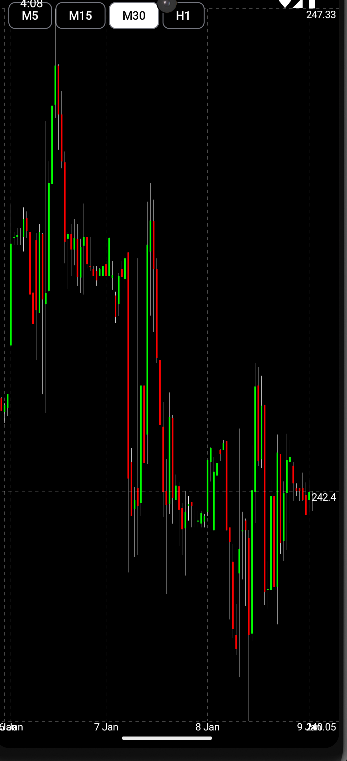

# 📊 GraphicsCompose

**GraphicsCompose** — Android-приложение для построения кастомных графиков на **Jetpack Compose**.  
Главный акцент проекта — **логика построения графиков и работа с разными таймфреймами**.  

Данные берутся с API, а графики можно приближать и листать, изменять диапазон времени для анализа.

---

## ✨ Основные возможности
- Построение интерактивных графиков на **Compose**  
- Поддержка разных таймфреймов (интервалов времени)  
- Приближение и листание графиков  
- **Flow**  
- Простейшая реализация **MVVM**  
- Реактивное обновление графиков при смене таймфрейма  

---

## 🏗 Архитектура
Проект построен на **MVVM** с использованием Flow: 

---

## 🛠 Используемые технологии
| Слой | Технологии |
|------|------------|
| Jetpack Compose, Custom Graphs, MVVM |
| бизнес-логика графиков |
| Retrofit (API) |
| Kotlin Flow |
| Язык | Kotlin |

---

## 📸 Скриншоты

**Главный экран**  

**Приближение и листание графиков**  

**Загрузка при смене таймфрейма**  

---

## 📌 Особенности
- Основной упор на **кастомную визуализацию графиков**  
- Поддержка интерактивного анализа данных через таймфреймы  
- Отличный пример использования **Compose** для сложной отрисовки UI  

---
